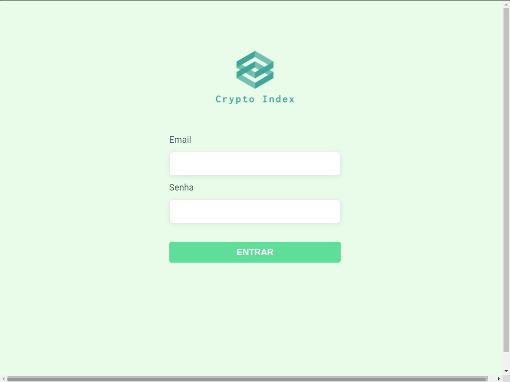
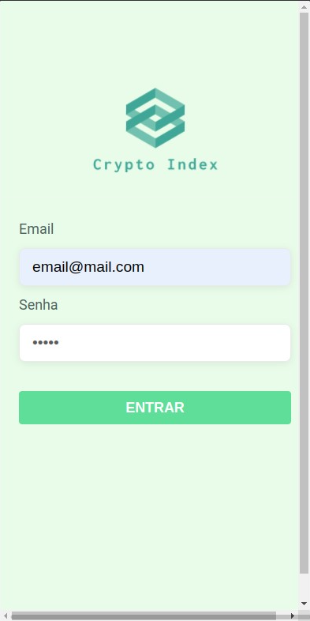

# Projeto - Crypto Index

## Boas vindas ao repositório do Projeto - Crypto Index

Esse é um projeto full-stack onde o usuário poderá ter acesso
ao preços do Bitcoin em diferentes moedas.
Essa é a parte do fron-end caso queira conhecer a API, pode acessar a Documentação
dela por aqui: [Crypto Index - Doc](https://crypto-index-back-end.herokuapp.com/api/docs/).

Você pode acessar o repositório do back-end por aqui: [crypto-index-back-end](https://github.com/JSouza27/crypto-index-back-end)
ou se desejar ver a aplicação rodando no seu navegador ou smartphone
acesse esse link: [Crypto Index](https://crypto-index-front-end.vercel.app/login).


### Stack utilizada

- [JavaScript](https://developer.mozilla.org/pt-BR/docs/Web/JavaScript)
- [Jest Js](https://jestjs.io/pt-BR/docs/tutorial-react)
- [React Testing Library](https://testing-library.com/docs/react-testing-library/intro/)
- [Styled Component](https://styled-components.com/docs/basics#getting-started)
- [ESLint](https://eslint.org/)
- [Vercel](https://vercel.com/docs)

---

## Screenshot

<div>
  
  
  
</div>


<div>
  
  
  
</div>


## Funcionalidades

A aplicação mostra a conversão dos valores do BitCoin em outras moedas
usando fazendo requisição da API [crypto-index](https://crypto-index-back-end.herokuapp.com/api/docs/).

Abaixo estão as premissas e os requisitos técnicos que a solução
deve possuir:

### Premissas

- [x] A aplicação deve fazer requisições para API crypto-index
- [x] A aplicação deve ser capaz de entregar os valores convertido do BitCoin
- [x] O acesso a aplicação deve ser permitido apenas por requisição
que utilizem um token válido, após fazer o login.

### Requisitos técnicos

- [x] A URL base da API deve ser `localhost:[PORTA]`
- [x] A aplicação deve ter uma página de login com a rota `/login`
- [x] A aplicação deve ter uma home na qual irá mostrar as moedas na rota `/`
- [x] A aplicação deve ter uma página para atualizar o valor da cotação de uma moeda

## Rodando localmente

Os comandos abaixo são para serem utilizados no terminal 
do Ubunto, caso utilize outro sistema operacional 

### Clonando o repositório

1. Abra o terminal e digite o comando abaixo

```bash
  git clone git@github.com:JSouza27/crypto-index-front-end.git
```

2. Ainda no terminal entre no diretório em que você clonou

```bash
  cd crypto-index-front-end
```

3. Instale as dependências

```bash
  npm install
```

4. Inicie o servidor

```bash
  npm start
```

5. Para que a aplicação se conecte com a API, será necessário usar
uma variável de ambiente: 

- Dentro da pasta clonada crie um arquivo `.env`
- Abra o arquivo `.env` e acrescente a váriavel abaixo

```bash
  REACT_APP_BASE_API=https://crypto-index-back-end.herokuapp.com/api
```
- Agora você está pronto usar a aplicação

**Para fazer login pode usar qualquer email genérico e senha (com 6 numeros)

### Vendo a aplicação on-line

6. Utilizei o servidor [Vercel](https://vercel.com/docs) para efetuar
o deploy da aplicação e para acessa-la basta clicar nesse [aqui](https://crypto-index-front-end.vercel.app/login)

**Para fazer login pode usar qualquer email genérico e senha (com 6 numeros)
## Rodando os testes

1. Para rodar os teste basta usar o comando abaixo.


```bash
  npm test
```

2. Caso queira rodar o test de cobertura, use o comando abaixo


```bash
  npm run test:coverage
```

## Autores

- [@JSouza27](https://github.com/JSouza27)


## Deploy

Deploy feito no [Vercel](https://vercel.com/docs)

